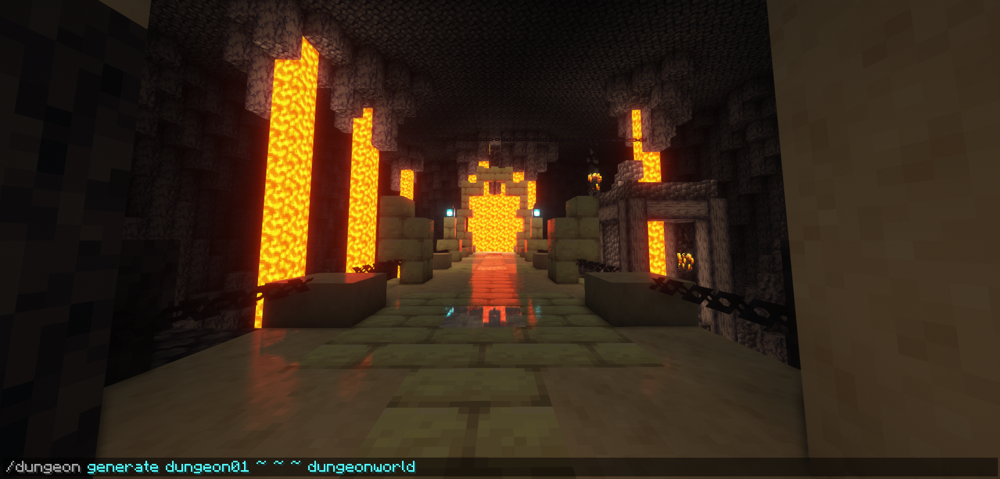
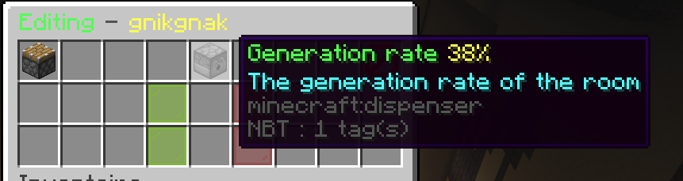
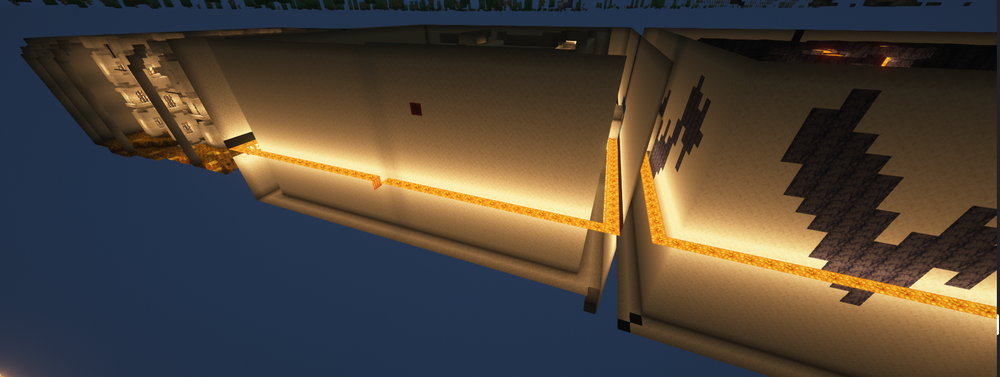

  
   
  Logo Made By <a href="https://github.com/Zarinoow">Zarinoow</a>

# ProceduralDungeon
ProceduralDungeon allows you to generate dungeons procedurally. That means, depending on the parameters entered and the pre-saved rooms, it generates a set of random rooms.

  
  <a href="https://bstats.org/plugin/bukkit/ProceduralDungeon/13962">
    Bstats page !
  </a>

# Feature :
  - Register more than **36 rooms** (The first 36 rooms are configurable)
  - Can generate **one room** as **sixty-four** (Maximum theoretical value)
  - **Generation rates** configurable by rooms
  - Choose if the plugin can **reuse rooms**
  - Generatable from the **user** or the **console** (Not configurable for the console)
  - **Configure** the dungeon or room as a **team**

  

 
# Permissions with their commands:
  - `proceduraldungeon.dungeon`   Use the command `/dungeon` and `/dungeon help`
  - `proceduraldungeon.admin.reload`   Reload the configuration and reload dungeons with `/dungeon reload`
  - `proceduraldungeon.admin.create`   Create or import an existing dungeon with `/dungeon create {folder}`
  - `proceduraldungeon.admin.remove`   Removes the dungeon from the configuration and keeps these files with `/dungeon remove {dungeon}`
  - `proceduraldungeon.admin.delete`   Permanently deletes a dungeon including files with `/dungeon delete {dungeon}`
  - `proceduraldungeon.admin.addroom`   Creates a room for the specified dungeon with `/dungeon setexit` before and `/dungeon addroom {dungeon} (customname)`
  - `proceduraldungeon.admin.generate`   Generates the specified dungeon depending on these properties `/dungeon generate {dungeon} {x} {y} {z} (world)`
  - `proceduraldungeon.admin.edit`   Configure properties of a dungeon or a room with `/dungeon edit {dungeon}`
  - `proceduraldungeon.admin.edit.deleteroom`   Allows you to remove a room from a dungeon (interaction through the GUI)
  - `proceduraldungeon.admin.list`   List of all imported or importable dungeons with `/dungeon list`
  
`{}` are the required arguments 
`()` are the optional arguments 
`folder` is the name of the dungeon folder 
`dungeon`is the name of one of the dojons imported 
`customname` is a custom name for the room (not customizable otherwise) 
`x`, `y`, `z` are the coordinates where the dungeon should appear in the front (You can use ~ for your position) 
`world` is the world in which it must be generated 

  

# Know issue :
- __Actually none__

# Idea for future updates :
  - Skript Implementation
  - Generation of labyrinth rooms (not a straight line)
  - Final room with random rewards
  - Automated generation
  - Increases the 36 rooms limit

# Installation Guide :
1) Ensure you have the latest version of the game running on the server.
2) Install the <a href="https://github.com/Zarinoow/ProceduralDungeon/releases/latest">latest<a/> version of plugin in the `/plugin` folder.
3) Verify you have correctly installed <a href="https://dev.bukkit.org/projects/worldedit/files">WorldEdit</a> or <a href="https://ci.athion.net/job/FastAsyncWorldEdit/">FastAsyncWorldEdit</a>
4) Restart the server (**NOT RELOAD !**)
5) Enjoy the plugin !

# Get support :
**Discord:** https://discord.gg/jbg6x8Buum

# Terms of use
- My plugin is public and free to use, please be respectful of my work.
- The code of my plugin is open to anyone who is interested to learn more about programming. It is **under no circumstances tolerated to copy or steal my code** without my prior consent!
- It is strictly forbidden to modify the source code of my plugin without my prior agreement.
- I have no obligation to maintain this project, it is free and takes my own time, thank you for understanding.
- Have fun using it!
